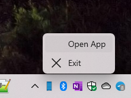

# MyPhone

## Abstract
My [Lumia]phone assistant

Status: alpha (RnD)

## Progress 
- I am trying to find some analouges that support BT links between PC and My winphone Lumia...

## Project Status
- RnD (sdk, apps, etc.) >> [5%]
- Design (artwork, etc.) +- [30%]
- Tech. project (Desktop Bridge, Systray, etc.)+- [20%]
- Dev (Codebase) - [0%]
- "Intro" (Bringing some result to Lumia fans...)- [0%]

## Screenshots

## Tech. reqs
"Standard" os build - 19041
Min os build - 18xxx

-- [m][e] 2022 