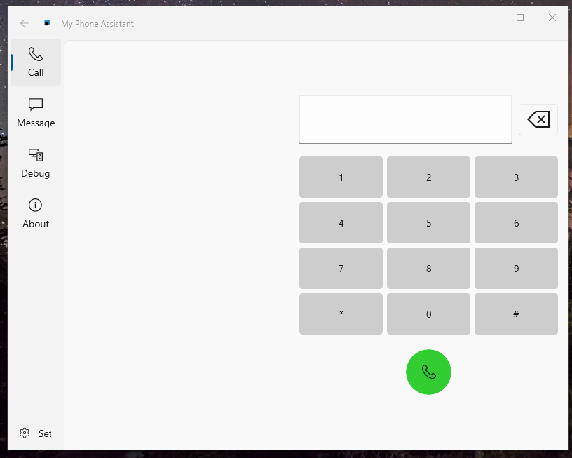

# MyPhone

## Abstract
My [Lumia]phone assistant

Status: alpha (RnD)

## The beginning 
When web-serfing I found some source code of "MyPhone" App (for iPhone/ Android-phone / Windows 10 Mobile phone "interconnect"... 
The code was uncomplete (legasy?), 3 years old. But the idea for "any phone" BT linking is interesting , IMHO.

I started to exploring GitHub. My fast finding (thanks code mathing github's superfeature): 

https://github.com/BestOwl/MyPhone/  

This code seems to be ok... idk... so, I forked the "newest" code... it's 2 years old, heh! :)

## Progress 
- I am trying to find some analouges that support BT links between PC and My winphone Lumia...

## Project Status
- RnD (sdk, apps, etc.) >> [75%]
- Design (artwork, etc.) +- [50%]
- Tech. project (Desktop Bridge, Systray, etc.)+- [50%]
- Dev (Codebase) - [30%]
- "Intro" (Bringing some result to Lumia fans...)- [0%]

## Screenshots

## Tech. reqs
- "Standard" os build - 10.0.18362.2005 (WinSDK 18362)
- Min os build - 10.0.18362.2005 
- Some phone (W10M, iPhone on Android based) with active SIM card (calls/messages)

## My fast RnD details
- I havenot any SIM installed in my Lumia phone... so, I cannot debug phoneline/calls "interconnect"
- I detected that "newest" MyPhone build (master branch) after 1st start does some systray and activates "autostart feature"
  ... interesting :)

## "Workplace"
- PC/Notebook with Bluetooth activated
- Windows 10 version 1903 or above
- Visual Studio 2022 with .NET, UWP and C++ workload
- Lumia phone (or other mobile device) 

### Build
1. Clone repo
   `git clone --recursive https://github.com/BestOwl/MyPhone.git`
2. Open `MyPhone.sln` with Visual Studio
3. Set `PackageProject` as startup project
4. Set build architecture to ARM, x86 or x64. (AnyCPU is not supported)
5. Build and run 

##Thanks
[BestOwl](https://github.com/BestOwl/MyPhone/) MyPhone's developer/author

-- [m][e] 2022 